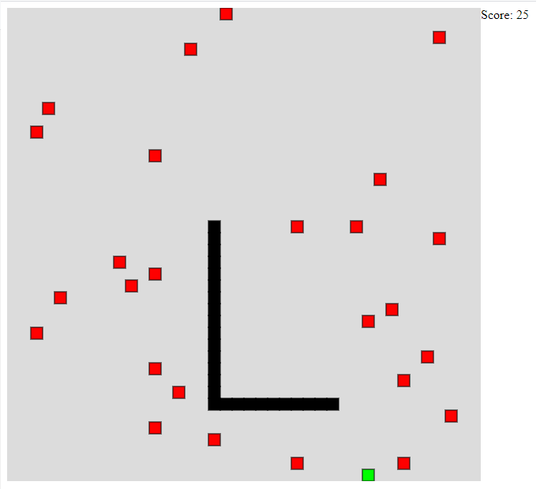

# snake101
A simple snake game written in Javascript

### Project Definition

This project is a basic application of [p5.js](https://p5js.org/) which provides a canvas to draw graphics on. Also, p5.js comes up with keyboard and mouse hook functionalities. 
Therefore, it has everything for a basic snake game.

### How to Play

Keyboard arrows for directions
Space button for stopping

### Screenshots

